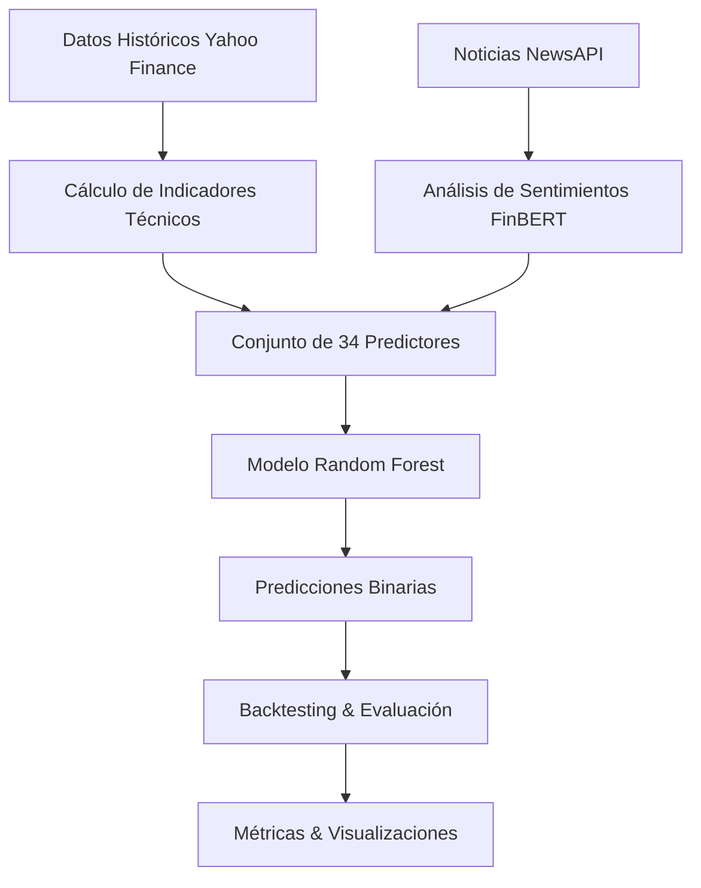

# 📈 Sistema de Predicción de Acciones con Machine Learning

Un sistema avanzado de predicción bursátil que combina análisis técnico, indicadores financieros y análisis de sentimientos de noticias para predecir la dirección del mercado de valores.


## 🚀 Características Principales

- **🤖 Modelo de Machine Learning**: Random Forest con 34 indicadores técnicos
- **📰 Análisis de Sentimientos**: Procesamiento de noticias financieras con FinBERT
- **📊 Interfaz Gráfica Completa**: GUI interactiva con visualizaciones en tiempo real
- **⚡ Backtesting Robusto**: Evaluación histórica del rendimiento del modelo
- **🎯 Métricas Detalladas**: Accuracy, precision y análisis de importancia de predictores

## 🏗️ Arquitectura del Sistema

### Componentes Principales

```
📦 Stock-Market-Prediction-System
├── 🧠 Modelo ML (Random Forest)
├── 📊 Análisis Técnico (34 indicadores)
├── 📰 Análisis de Sentimientos (FinBERT)
├── 🖥️ Interfaz Gráfica (Tkinter)
├── 📈 Visualizaciones (Matplotlib)
└── ⚙️ Sistema de Backtesting
```

### Flujo de Datos



## 🧠 Modelo de Machine Learning

### Algoritmo: Random Forest
- **N_estimators**: 200 árboles
- **Min_samples_split**: 50
- **Random_state**: 1 (reproducibilidad)

### 📊 Predictores Técnicos (34 indicadores)

#### Indicadores de Momentum
- **RSI** (Relative Strength Index) - 14 períodos
- **Williams %R** - 14 períodos
- **Rate of Change (ROC)** - 10 períodos
- **MACD** (Moving Average Convergence Divergence)
- **MACD Signal** y **MACD Histogram**

#### Medias Móviles y Tendencias
- **SMA** (Simple Moving Average) - 5, 10, 20, 50 períodos
- **EMA** (Exponential Moving Average) - 12, 26 períodos
- **Relaciones SMA** (SMA_5/SMA_20, SMA_10/SMA_50)

#### Indicadores de Volatilidad
- **Bollinger Bands** (Superior, Inferior, %B, Ancho)
- **Average True Range (ATR)** - 14 períodos
- **Volatilidad Rolling** - 10 períodos

#### Indicadores de Volumen
- **Volume SMA** - 10 períodos
- **Volumen relativo** vs promedio

#### Indicadores de Precio
- **Precio vs máximos/mínimos** de 5, 10, 20 días
- **Retornos** de 1, 3, 5 días
- **Gaps** de apertura

#### 📰 Análisis de Sentimientos (3 indicadores)
- **Sentiment_Positive**: Probabilidad de noticias positivas
- **Sentiment_Negative**: Probabilidad de noticias negativas  
- **Sentiment_Neutral**: Probabilidad de noticias neutrales

## 🎯 Variable Objetivo

El sistema predice la **dirección del precio** (binario):
- **1**: El precio subirá al día siguiente
- **0**: El precio bajará al día siguiente

La predicción se basa en si el precio de cierre del día siguiente será mayor que el precio de cierre actual.

## 📰 Limitaciones del Análisis de Sentimientos

### ⚠️ Restricciones Actuales

El análisis de sentimientos tiene limitaciones importantes debido a las restricciones de la API gratuita de NewsAPI:

#### 🔒 API Gratuita (Actual)
- **Historial**: Solo 30 días de noticias
- **Requests**: 1,000 por día
- **Cobertura**: Limitada geográficamente
- **Impacto en predicción**: ☆☆☆☆☆ (Mínimo)

#### 🚀 API Developer ($449/mes)
- **Historial**: 5 años de noticias completas
- **Requests**: Ilimitados
- **Cobertura**: Global completa
- **Impacto esperado**: ⭐⭐⭐⭐⭐ (Máximo)

### 📈 Potencial de Mejora

Con acceso a la API avanzada, el modelo podría:

1. **Entrenar con contexto histórico completo** de noticias (5 años)
2. **Correlacionar eventos específicos** con movimientos de precios
3. **Identificar patrones estacionales** en sentimientos
4. **Mejorar accuracy estimado**: Del actual 50-55% a 60-70%

> **💡 Nota**: Actualmente, las predicciones se basan principalmente en indicadores técnicos. El análisis de sentimientos solo afecta predicciones de los últimos 30 días donde hay noticias disponibles.

## 🛠️ Instalación y Configuración

### Prerrequisitos
- Python 3.8+
- pip (gestor de paquetes)

### 1. Clonar el Repositorio
```bash
git clone https://github.com/JoacoMarc/Stock-Market-Prediction-with-Machine-Learning.git
cd Stock-Market-Prediction-with-Machine-Learning
```

### 2. Crear Entorno Virtual
```bash
python -m venv .venv
source .venv/bin/activate  # Linux/Mac
# .venv\Scripts\activate   # Windows
```

### 3. Instalar Dependencias
```bash
pip install -r requirements.txt
```

### 4. Configurar API Key
```bash
# Copia el archivo de configuración
cp .env.example .env

# Edita .env y agrega tu API key de NewsAPI
NEWS_API_KEY=tu_api_key_aqui
```

#### Obtener API Key de NewsAPI:
1. Visita [newsapi.org/register](https://newsapi.org/register)
2. Regístrate gratuitamente
3. Copia tu API key
4. Pégala en el archivo `.env`

### 5. Ejecutar la Aplicación
```bash
python main.py
```

## 📱 Uso de la Aplicación

### Interfaz Principal

La aplicación cuenta con una interfaz gráfica intuitiva dividida en pestañas:

#### 🏠 Entrada de Datos
- **Símbolo Bursátil**: Ej. AAPL, MSFT, GOOGL
- **Nombre de la Empresa**: Ej. Apple, Microsoft, Google
- **Botón Analizar**: Inicia el proceso de predicción

#### 📈 Pestaña Métricas
- **Accuracy**: Porcentaje de predicciones correctas
- **Precision**: Calidad de las predicciones positivas
- **Información del Dataset**: Registros, predictores, período

#### 🏆 Pestaña Predictores
- **Top Predictores**: Lista ordenada por importancia
- **Configuración**: Cantidad de predictores a mostrar
- **Valores numéricos**: Importancia relativa de cada indicador

#### 📊 Pestaña Gráficos
- **Predicciones vs Realidad**: Comparación temporal
- **Accuracy por Período**: Evolución del rendimiento
- **Distribución**: Análisis de predicciones vs targets
- **Importancia**: Ranking visual de predictores

#### 📋 Pestaña Logs
- **Proceso detallado**: Cada paso del análisis
- **Errores y warnings**: Información de debug
- **Estadísticas**: Métricas del proceso

### Ejemplo de Uso

1. **Ingresar datos**:
   ```
   Símbolo: AAPL
   Empresa: Apple
   ```

2. **Hacer clic en "Analizar Acción"**

3. **Esperar el proceso** (2-5 minutos):
   - Descarga de datos históricos
   - Cálculo de indicadores técnicos
   - Obtención de noticias
   - Análisis de sentimientos
   - Entrenamiento del modelo
   - Backtesting

4. **Revisar resultados** en las pestañas

## 📊 Interpretación de Resultados

### Métricas de Rendimiento

#### Accuracy
- **> 60%**: Excelente rendimiento
- **55-60%**: Buen rendimiento
- **50-55%**: Rendimiento aceptable
- **< 50%**: Necesita mejoras

#### Precision
- **> 0.65**: Alta confiabilidad en predicciones positivas
- **0.55-0.65**: Confiabilidad moderada
- **< 0.55**: Baja confiabilidad

### Predictores Importantes

Los predictores más influyentes suelen ser:
1. **Indicadores de momentum** (RSI, MACD)
2. **Relaciones de medias móviles**
3. **Indicadores de volatilidad**
4. **Retornos recientes**
5. **Sentimientos** (cuando hay noticias disponibles)

## 🔧 Configuración Avanzada

### Variables de Entorno (.env)

```bash
# API Configuration
NEWS_API_KEY=tu_api_key
NEWS_API_BASE_URL=https://newsapi.org/v2/everything
NEWS_API_LANGUAGE=en
NEWS_API_SORT_BY=relevancy

# Model Configuration
MODEL_RANDOM_STATE=1
MODEL_N_ESTIMATORS=200
MODEL_MIN_SAMPLES_SPLIT=50

# Backtesting Configuration
BACKTEST_START_SIZE=2500
BACKTEST_STEP_SIZE=250
```

### Personalización del Modelo

Para modificar el modelo, edita `stock_analysis.py`:

```python
# Cambiar parámetros del Random Forest
model = RandomForestClassifier(
    n_estimators=300,      # Más árboles
    min_samples_split=30,  # Menor split
    max_depth=10,          # Limitar profundidad
    random_state=1
)
```

## 📁 Estructura del Proyecto

```
📦 Stock-Market-Prediction/
├── 📄 main.py                 # Interfaz gráfica principal
├── 📄 data_from_stock.py      # Descarga y procesamiento de datos
├── 📄 stock_analysis.py       # Modelo ML y backtesting
├── 📄 news_analysis.py        # Análisis de sentimientos
├── 📄 stock_graph.py          # Funciones de visualización
├── 📄 .env                    # Variables de entorno
├── 📄 .gitignore             # Archivos ignorados por git
├── 📄 requirements.txt        # Dependencias
├── 📄 README.md              # Este archivo
└── 📁 __pycache__/           # Cache de Python
```

## 🔬 Metodología Científica

### Backtesting
- **Ventana móvil**: 2500 días iniciales, pasos de 250 días
- **Validación temporal**: Sin look-ahead bias
- **Train/Test splits**: Secuencial en el tiempo

### Evaluación
- **Métricas múltiples**: Accuracy, Precision, Recall
- **Análisis de distribución**: Balanceo de clases
- **Importancia de features**: Interpretabilidad del modelo

### Robustez
- **Cache de noticias**: Evita requests duplicados
- **Manejo de errores**: Graceful degradation
- **Validación de datos**: Verificación de calidad

## 🚧 Limitaciones y Mejoras Futuras

### Limitaciones Actuales
1. **Datos de noticias limitados** (30 días)
2. **Modelo binario simple** (subir/bajar)
3. **Sin análisis fundamental** (P/E, revenues, etc.)
4. **Dependencia de datos históricos** únicamente

### Mejoras Propuestas
1. **🔮 Predicción multi-día** (1, 3, 7 días)
2. **📊 Regresión de precios** (valores exactos)
3. **💰 Datos fundamentales** (estados financieros)
4. **🧠 Deep Learning** (LSTM, Transformers)
5. **📈 Trading automatizado** (órdenes reales)
6. **⚡ Tiempo real** (predicciones intraday)

## 🤝 Contribuir

### Cómo Contribuir
1. Fork del repositorio
2. Crear rama feature (`git checkout -b feature/AmazingFeature`)
3. Commit cambios (`git commit -m 'Add AmazingFeature'`)
4. Push a la rama (`git push origin feature/AmazingFeature`)
5. Crear Pull Request

### Áreas de Contribución
- 🐛 **Bug fixes**
- ✨ **Nuevas features**
- 📚 **Documentación**
- 🧪 **Tests**
- 🎨 **UI/UX mejoras**

## 📝 License

Este proyecto está bajo la Licencia MIT - ver el archivo [LICENSE](LICENSE) para detalles.

## 🙏 Reconocimientos

- **Yahoo Finance**: Datos históricos de acciones
- **NewsAPI**: Noticias financieras
- **FinBERT**: Modelo de análisis de sentimientos financiero
- **Scikit-learn**: Framework de Machine Learning
- **Matplotlib**: Visualizaciones
- **Tkinter**: Interfaz gráfica

## 📞 Contacto

**Joaquín Marcoff** - [@JoacoMarc](https://github.com/JoacoMarc)

**Proyecto**: [Stock-Market-Prediction-with-Machine-Learning](https://github.com/JoacoMarc/Stock-Market-Prediction-with-Machine-Learning)

---

⭐ **¡No olvides dar una estrella al proyecto si te resultó útil!** ⭐